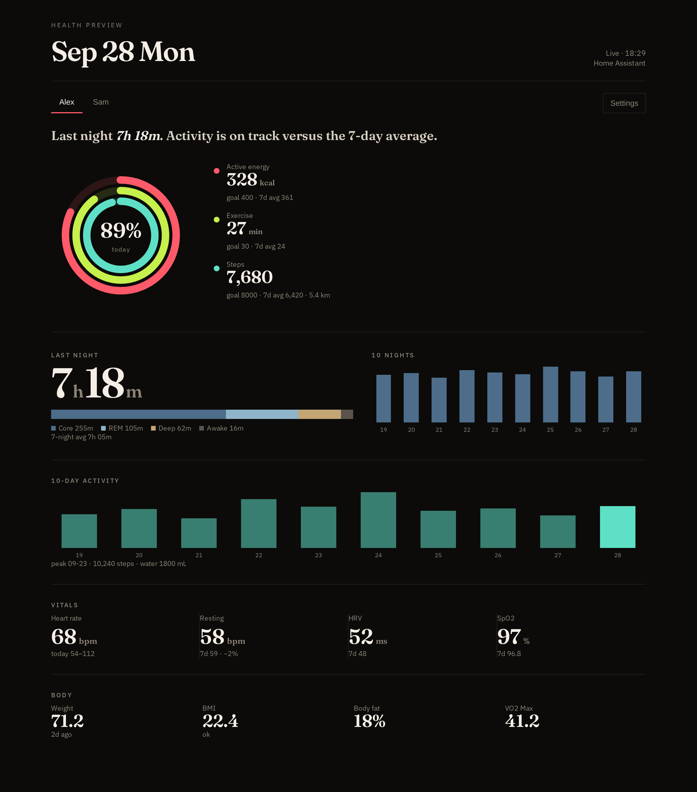
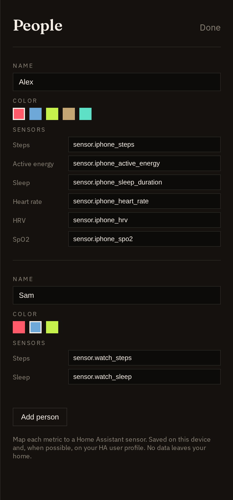

# Health Preview Card

Editorial Apple Health–style dashboard for Home Assistant: activity rings, sleep stages, 7-day stats, vitals, body metrics.



- One tab per person, each with its own accent color
- In-card **Settings** to add people and map HA sensors — YAML optional
- Reads only entities already in Home Assistant
- No cloud account, no telemetry, no personal samples in this repo



## Install (HACS)

1. HACS → **⋯** → Custom repositories
2. URL: `https://github.com/zomosky/ha-health-preview`  
   Category: **Lovelace**
3. Download **Health Preview Card**
4. Add a **panel** view:

```yaml
type: panel
title: Health
path: health
icon: mdi:heart-pulse
cards:
  - type: custom:health-preview-card
```

Or **Add card** → Custom: Health Preview.

Then open the card → **Settings** → add a person → map sensors → **Done**.

---

## Getting Apple Health into Home Assistant

The card does **not** talk to Apple. It only displays Home Assistant `sensor.*` entities. You must push HealthKit data into HA first.

The official HA Companion App on iPhone exposes **motion coprocessor** stats only (steps, distance, floors, pace). It does **not** expose heart rate, sleep, HRV, SpO2, or calories.

| You need | Native HA iOS app | iOS Shortcuts (free) | Health Auto Export (paid) |
|----------|-------------------|----------------------|---------------------------|
| Steps / distance / floors | Yes | Yes | Yes |
| Heart rate, HRV, SpO2 | No | Yes | Yes |
| Sleep stages | No | Yes | Yes |
| Active / resting energy | No | Yes | Yes |
| Weight, VO2 Max | No | Yes | Yes |

### Option A — iOS Shortcuts (free)

Works with Apple Watch or any source already writing into the Health app.

1. Create a HA **long-lived access token** (Profile → Security).
2. In Shortcuts, for each metric:
   - **Find Health Samples** (type = Heart Rate / Steps / Sleep / …)
   - Sort newest first, limit 1 (or a batch loop for heart rate)
   - **Get Details of Health Sample** → Value
   - **Get Contents of URL**  
     `POST https://<your-ha>/api/states/sensor.health_heart_rate`  
     Headers: `Authorization: Bearer <token>`, `Content-Type: application/json`  
     Body: `{"state": <value>, "attributes": {"unit_of_measurement": "bpm", "source": "AppleHealth"}}`
3. Automate the Shortcut (hourly or every 4 hours). iOS time automations cannot be shorter than 1 hour.

Use stable English entity IDs, for example:

```
sensor.health_heart_rate
sensor.health_resting_heart_rate
sensor.health_steps
sensor.health_active_energy
sensor.health_sleep_duration
sensor.health_deep_sleep
sensor.health_spo2
```

HA creates the entity on the first successful POST.

**Tips**

- `state` must be a number, not the words “health sample”.
- For timestamps, add **Format Date** → ISO 8601 and put it in `attributes.measured_at`.
- One person = one prefix (`sensor.alex_*`). A second person should use a different prefix.

### Option B — Health Auto Export (paid)

[Health Auto Export](https://apps.apple.com/app/health-auto-export-json-csv/id1115567069) can push many HealthKit types to HA in one automation.

1. HA long-lived token
2. App → Automation → Home Assistant → your HA URL + token
3. Select metrics → export
4. Entities appear as `sensor.<phone_name>_*` (name depends on the device / automation)

Map whatever IDs you get in the card Settings dropdown.

### After sensors exist

Open Health Preview → **Settings**:

| Card key | Typical HA entity |
|----------|-------------------|
| `steps` | `sensor.health_steps` |
| `energy` | `sensor.health_active_energy` |
| `exercise` | `sensor.health_exercise_time` |
| `distance` | `sensor.health_distance` |
| `sleep` | `sensor.health_sleep_duration` |
| `core` / `deep` / `rem` / `awake` | sleep stage sensors, **minutes** |
| `hr` / `rhr` / `hrv` | heart rate / resting / HRV |
| `spo2` | blood oxygen |
| `weight` / `fat` / `height` / `vo2` | body |

Leave unused keys empty. Sleep values must be **minutes** (438 = 7h 18m), not hours.

Optional YAML seed (Settings overrides this after first save):

```yaml
type: custom:health-preview-card
people:
  - id: me
    name: Me
    color: "#ff5a6a"
    sensors:
      steps: sensor.health_steps
      energy: sensor.health_active_energy
      sleep: sensor.health_sleep_duration
      hr: sensor.health_heart_rate
```

---

## Privacy

This repository ships **no** personal health samples, real device IDs, tokens, or household names. Preview images use fictional data. The card only queries entities you map; nothing is sent off your Home Assistant.

## 中文

类似 Apple 健康的 Home Assistant Lovelace 卡片（活动环、睡眠分段、近 7 日统计）。一人一个标签，可设主色。卡片内 Settings 绑定传感器。

仓库：https://github.com/zomosky/ha-health-preview  
HACS → 自定义仓库 → **Lovelace**。

### Apple 健康怎么进 HA

Companion App **只能**同步步数/距离/楼层，**没有**心率、睡眠、HRV、血氧、卡路里。

要用完整数据，选一条：

1. **快捷指令（免费）**  
   「查找健康样本」→ 取出数值 → `POST /api/states/sensor.health_heart_rate`（Bearer 长期令牌）。  
   每个指标一个实体，英文 ID。第二个人换前缀，例如 `sensor.sam_heart_rate`。
2. **Health Auto Export（付费）**  
   在 App 里填 HA 地址和令牌，导出后会出现 `sensor.<设备名>_*`，在卡片 Settings 里对上即可。

睡眠请用**分钟**。Settings 里把 `steps` / `sleep` / `hr` 等 key 填成你的实体 ID。

## License

MIT
